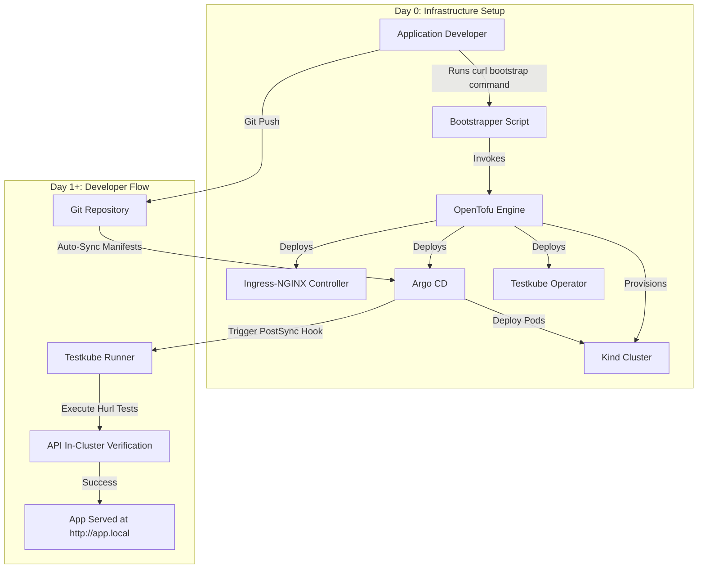

# Developer Platform Design & Critical Requirements Analysis

## 1. Problem Statement & Objectives

The application development team has built a new three-tier application (React frontend, Node.js backend API, and a PostgreSQL database) hosted at [github.com/finn-e/testkube-samples](https://github.com/finn-e/testkube-samples). However, the team lacks familiarity with Kubernetes. 

Our goal is to design a developer platform and deployment tooling that accomplishes two main objectives:
1. **Insulate Developers from Kubernetes Complexity**: Craft a great developer experience (DevEx) where developers do not have to write, configure, or maintain Kubernetes manifests (YAML) or manage cluster routing.
2. **Ensure Reliable, Automated Delivery**: Create an automated deployment and testing pipeline that runs seamlessly from code commits to verified, live service endpoints. The infrastructure setup is managed through the repository [github.com/finn-e/testkube-samples-infrastructure](https://github.com/finn-e/testkube-samples-infrastructure).

### Platform Lifecycle Architecture
To meet these objectives, the proposed design splits the platform lifecycle into two decoupled phases—both designed to be executed directly by the developer with minimal effort:

*   **Day 0 (Platform Bootstrap)**: A one-time setup that builds the local Kubernetes cluster, registers ingress controllers, sets up local loopback DNS, and installs GitOps and testing operators. A developer initiates this setup by running a single command:
    ```bash
    curl -fsSL https://raw.githubusercontent.com/finn-e/testkube-samples-infrastructure/trunk/run-testkube-samples.sh | bash
    ```
*   **Day 1+ (Developer Loop)**: A continuous, transparent workflow where developers commit code to Git. The platform handles building, deploying, and verifying the application inside the cluster network.



---

## 2. Recorded Design Assumptions

To establish a predictable and reliable developer platform, the design relies on the following core assumptions:

*   **Local Developer Use Case**: It is assumed that the primary need for the development team is the ability to spin up a fully functioning local Kubernetes development cluster.
*   **Local Machine Environment**: It is assumed that developers are spinning up this cluster directly on their physical workstations (laptops/desktops) rather than on a remote server (although the platform architecture is designed such that it will operate correctly on a remote server as well).
*   **Host OS & System Access**: It is assumed that the developer's local machine runs a modern Linux distribution (specifically supporting Debian/Ubuntu, RedHat/Fedora, or Arch Linux) and that the user has `sudo` privileges to modify local loopback mapping configs (e.g. `/etc/hosts`) and bind to ports 80 and 443.
*   **Repository Decoupling**: It is assumed that infrastructure configurations (IaC, Helm manifests, Kubernetes resources) and application source code reside in separate, decoupled Git repositories. This prevents application developers from accidentally breaking platform configurations.
*   **Stateless Testing Model**: It is assumed that API integration test suites are stateless. Ephemeral databases using in-memory configurations (such as Kubernetes `emptyDir`) are spun up dynamically to run test assertions, bypassing local persistent volume storage locks and write permission conflicts.
*   **Local Single-User Resources**: It is assumed that the primary target environment for this MVP is a single-developer workstation with limited hardware resources, requiring a lightweight container virtualization engine (Docker/Kind) rather than hypervisor-based setups (Minikube).

---

## 3. Critical Requirements Analysis

Deploying a three-tier app (frontend, API, and database) to Kubernetes requires addressing several technical decisions:

### Requirement 1: Developer Experience & Delivery Model (GitOps vs. Skaffold)
*   **Analysis**: Skaffold watches local file changes, rebuilding and pushing containers on every save. While fast, it requires developers to install local build engines (Docker/Podman), run active background daemons on their host machines, and learn Skaffold config schemas.
*   **Selected Design**: A **GitOps** model driven by **Argo CD**. Developers interact exclusively with native Git commands. Kubernetes configuration complexity is abstracted away into an infrastructure repository maintained by platform engineers.

### Requirement 2: Local Cluster Engine (Kind vs. Minikube)
*   **Analysis**: Minikube requires spinning up full hypervisor virtual machines (using VirtualBox or KVM), pre-allocating large amounts of CPU and memory resources from the developer's workstation. 
*   **Selected Design**: **Kind (Kubernetes in Docker)**. Kind runs cluster nodes as lightweight containers on Docker. It starts up in seconds, has a minimal memory footprint, and supports loading local images directly (`kind load`) to bypass remote registry pull limits.

### Requirement 3: Workload Sizing & Storage (Stateless vs. Stateful)
*   **Analysis**: The React frontend and Node.js API do not hold persistent data and can scale horizontally or restart without data loss. The PostgreSQL database requires stable storage. Running the database as a stateless deployment risks data loss during pod restarts or rescheduling.
*   **Selected Design**: The React frontend and Node.js API are run as stateless **Deployments**. The PostgreSQL database is run as a **StatefulSet** bound to a **PersistentVolumeClaim (PVC)** to ensure stable network identifiers and data persistence.

### Requirement 4: Sizing & Autoscaling (VPA vs. HPA)
*   **Analysis**: Horizontal Pod Autoscalers (HPA) scale out pod replicas to handle traffic load. However, on a single-developer workstation, HPA is highly wasteful of system memory. Furthermore, HPA cannot prevent a single memory-intensive thread from crashing a pod.
*   **Selected Design**: **Vertical Pod Autoscaler (VPA)**. VPA dynamically adjusts the CPU and memory requests and limits of a single pod on-demand. This prevents Out-Of-Memory (OOM) container crashes while preserving the host workstation's memory resources.

### Requirement 5: Local Routing & Ingress Gateway
*   **Analysis**: Developers need to access their services locally under standard domains without managing complex port-forwarding tunnels.
*   **Selected Design**: An integrated **Ingress-NGINX** controller handles routing. The bootstrapper maps `app.local`, `argocd.local`, and `testkube.local` to `127.0.0.1` in `/etc/hosts`. The Ingress-NGINX controller routes path-based traffic under `app.local`: `/` requests go to the React frontend, and `/hello` or `/hello-pg` route to the Node.js API. The frontend queries endpoints relative to the current origin (`window.location.origin`), bypassing hardcoded ports.

### Requirement 6: Post-Deployment Verification (Testkube vs. Local Host Scripting)
*   **Analysis**: Traditional verification relies on running test scripts on the host machine against port-forwarded ports. This approach fails to test actual cluster DNS, internal routing rules, or network policies.
*   **Selected Design**: **Testkube** executes tests natively inside the cluster network. A Testkube runner executes declarative API requests defined in **Hurl** as an Argo CD `PostSync` hook. If the API tests fail, the deployment is flagged as failed, preventing broken sync states.

### Requirement 7: Local Environment Constraints (CPU & Permissions)
*   **Analysis**: Host filesystems and virtual environments introduce security and architecture mismatches (e.g., modern MongoDB 5.0+ requires AVX CPU instructions, which are missing on older hardware or VM hypervisors; database container write permissions often fail on host-path mounts).
*   **Selected Design**: Deploy an AVX-free MongoDB version (`mongo:4.4`) for Testkube's internal state database. Utilize ephemeral `emptyDir` volumes for database storage to bypass directory ownership conflicts (`UID 1001` failures) on host paths.

---

## 4. MVP Blueprint & Implementation Details

To validate this design, the MVP implementation uses the following tools:

### Day 0 Bootstrap (Declarative Provisioning)
OpenTofu coordinates the provisioning of the Kind cluster and core Helm charts (Ingress-NGINX, Argo CD, and the Testkube operator) in a single run. To handle the bootstrap dependency where providers need cluster access credentials before the cluster exists, credentials are passed dynamically:
```hcl
provider "kubernetes" {
  host                   = kind_cluster.default.endpoint
  client_certificate     = kind_cluster.default.client_certificate
  client_key             = kind_cluster.default.client_key
  cluster_ca_certificate = kind_cluster.default.cluster_ca_certificate
}
```
This dynamic binding forces OpenTofu to create the cluster before initializing the Kubernetes and Helm providers.

### Day 1+ Application Blueprint
*   **Argo CD Application**: Watches the application repository, automatically synchronizing changes.
*   **Hurl Test Runner**: Validates endpoint health and payload structure inside the cluster network.
*   **Stateless Test Execution**: The Testkube CLI is configured to run statelessly using `--client direct --api-uri` to skip configuration synchronization overhead.

---

## 5. Conclusion

By separating the lifecycle into Day 0 setup and Day 1+ continuous delivery, the proposed developer platform successfully hides Kubernetes primitives from developers while providing automated, native in-cluster verification. Running OpenTofu Helm and Kubernetes providers dynamically manages empty-state cluster bootstrap issues, and combining Argo CD with Testkube ensures that every code change is transparently deployed and validated against real cluster DNS and routing rules. Resolving local CPU and permission constraints guarantees a robust, low-footprint development environment directly on the developer's physical workstation.
